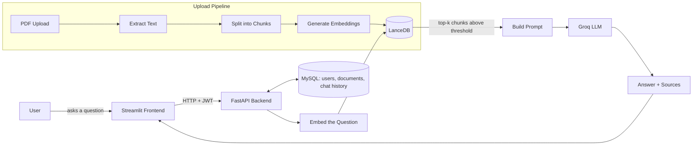

<div align="center">

# 📄 Enterprise AI Knowledge Assistant

🚀 **Live Demo:** [https://enterprise-ai-knowledge-assistant.streamlit.app](https://enterprise-ai-knowledge-assistant-khin4pttryulgiprkyr9ub.streamlit.app/)

**Upload your PDFs. Ask questions in plain English. Get answers with sources.**

A Retrieval-Augmented Generation (RAG) chatbot built with FastAPI, LanceDB and Groq — with a simple Streamlit UI on top.


</div>

---

## 📚 Table of Contents

- [What is this?](#-what-is-this)
- [Features](#-features)
- [How it works](#-how-it-works)
- [Tech Stack](#-tech-stack)
- [Project Structure](#-project-structure)
- [Getting Started](#-getting-started)
- [API Endpoints](#-api-endpoints)
- [Notes](#-notes)

---

## 🧠 What is this?

This project lets you upload PDF documents and then **chat with them**. Ask a question, and it:

1. Finds the most relevant chunks of text across *all* your uploaded documents
2. Feeds only that relevant context to an LLM (Groq)
3. Returns an answer — along with the **exact filename and page number** it came from

No answer is ever made up from outside the documents you uploaded — if nothing relevant is found, it says so instead of guessing.

---

## ✨ Features

| | |
|---|---|
| 🔐 **Auth** | JWT-based register/login, passwords hashed with `pwdlib` |
| 👤 **Roles** | `admin` accounts manage documents, everyone else just chats |
| 📤 **PDF Upload** | Text extracted with PyMuPDF, validated for type & size |
| ✂️ **Smart Chunking** | Recursive text splitting with overlap, so context isn't cut mid-sentence |
| 🧬 **Embeddings** | Local sentence-transformers model (`BAAI/bge-small-en-v1.5`) — no external API needed for search |
| 🔍 **Semantic Search** | Cosine similarity search over LanceDB, with a similarity threshold to filter out irrelevant matches |
| 📑 **Multi-Document Search** | One question can pull answers from multiple uploaded PDFs at once |
| 📌 **Source Citations** | Every answer shows which file, page, and chunk it came from |
| 💬 **Conversation Memory** | Remembers earlier messages in the same conversation, like ChatGPT |
| ⚡ **Streaming** | `/chat/stream` streams the answer token by token |
| 🕘 **Chat History** | View or clear the message history of any conversation |

---

## 🔄 How it works



---

## 🛠 Tech Stack

| Layer | Technology |
|---|---|
| **Backend** | FastAPI, SQLAlchemy |
| **Database** | MySQL — users, documents, chat history |
| **Vector Store** | LanceDB — chunk embeddings & similarity search |
| **Embeddings** | sentence-transformers (`BAAI/bge-small-en-v1.5`) |
| **LLM** | Groq (`llama-3.3-70b-versatile`) |
| **Auth** | JWT (PyJWT) + `pwdlib` password hashing |
| **Frontend** | Streamlit (separate app, talks to backend over HTTP) |
| **Package Manager** | [uv](https://github.com/astral-sh/uv) |

---

## 📂 Project Structure

```
app/
├── api/            # FastAPI routes — auth, documents, chat, search
├── services/       # Business logic — RAG pipeline, PDF parsing, chunking, embeddings, LLM
├── repositories/   # Database queries
├── db/models/      # SQLAlchemy models
├── schemas/        # Pydantic request/response models
└── core/           # Config, JWT security, logging

frontend/
└── streamlit_app.py   # Separate Streamlit UI — talks to the backend over HTTP only

tests/              # pytest tests
```

---

## 🚀 Getting Started

### 1. Install dependencies

```bash
uv sync
```

### 2. Configure environment

Create a `.env` file in the project root:

```env
DATABASE_URL=mysql+pymysql://<user>:<password>@127.0.0.1:3306/<db_name>
GROQ_API_KEY=your_groq_api_key
SECRET_KEY=any_random_secret_string
```

### 3. Start the backend

```bash
python main.py
```

Runs at **http://127.0.0.1:8000** — interactive API docs at `/docs`.

> Tables are created automatically on startup — no separate migration step needed.

### 4. Start the frontend

```bash
streamlit run frontend/streamlit_app.py
```

Runs at **http://localhost:8501**.

### 5. Create an admin

Register a user through the app, then set that user's `role` to `admin` directly in the `users` table — only admins can upload/manage documents.

---

## 🔌 API Endpoints

<details>
<summary><b>Auth</b></summary>

| Method | Endpoint | Description |
|---|---|---|
| `POST` | `/auth/register` | Create a new account |
| `POST` | `/auth/login` | Log in, get a JWT access token |
| `GET` | `/auth/me` | Get the current logged-in user |

</details>

<details>
<summary><b>Documents (admin only)</b></summary>

| Method | Endpoint | Description |
|---|---|---|
| `POST` | `/documents/upload` | Upload a PDF |
| `GET` | `/documents` | List uploaded documents |
| `DELETE` | `/documents/{id}` | Delete a document |

</details>

<details>
<summary><b>Chat</b></summary>

| Method | Endpoint | Description |
|---|---|---|
| `POST` | `/chat` | Ask a question, get an answer + sources |
| `POST` | `/chat/stream` | Same as above, streamed token by token |
| `GET` | `/chat/history` | Get message history for a conversation |
| `DELETE` | `/chat/history` | Clear a conversation's history |

</details>

<details>
<summary><b>Search</b></summary>

| Method | Endpoint | Description |
|---|---|---|
| `POST` | `/search` | Raw semantic search over document chunks |

</details>

---

## 📝 Notes

- Only `admin` users can upload, list, or delete documents — every logged-in user can chat.
- The similarity threshold and top-k retrieval count are configurable via `.env` (`SIMILARITY_THRESHOLD`, `TOP_K`).
- Answers are only generated from retrieved document context — if nothing relevant is found, the bot says so instead of hallucinating.
